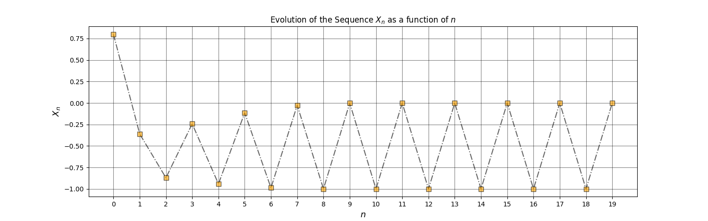

# 1D-Difference_Equation_Solver
This project executes the evolution of a one-dimensional difference equation and reveals its Cobweb plot, which is ideal for the study of the stability of cycles in those maps.

